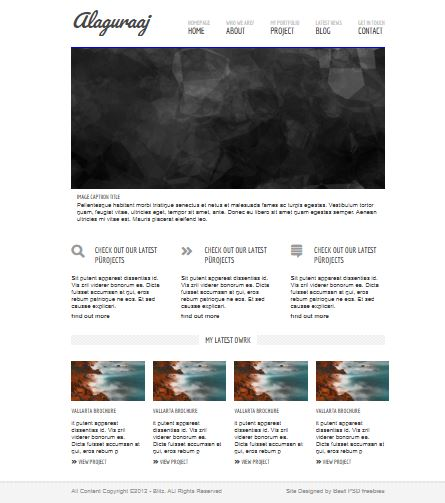

# HTML and CSS for Blitz Homepage

This project was created from the example of Udemy course

## Project Description:
- A multi-page website from the Blitz template
- Structuring the home page and other information derived from HTML and adding a style to that content by using CSS

**Build with: HTML and CSS**
